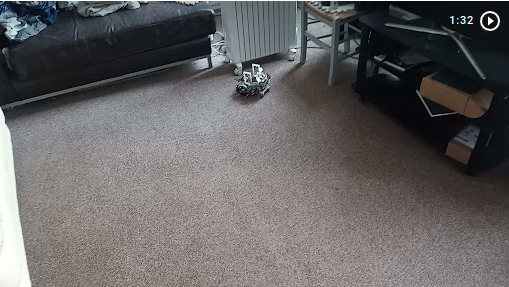

<a href="https://onedrive.live.com/embed?resid=6F1C4AC1EC8BBC89%21734346&authkey=!ANaUNHBdlH2EqQ8">hello</a>

# Raspberry Pi robot 

Obstacle avoiding raspberry pi robot, with distributed software architecture, at the moment this readme just gives an overview of what the hardware and software does.  Soon more information will be added on both how the software works and how it was designed. 

There are parts of this project that aren’t completed this will probably always be the case.  This is a passion project, it is something I plan to continuously experiment with refactor and add to.  Although there is much in an uncompleted state there is also much that can run and works brilliantly. 

This library works in conjunction with 3 other libraries. 

## Associated Libraries

This github library is the code which runs on the robot however the full system involved code running on other network locations and there is also code shared between the libraries.  The other libaries that make up the full system are listed bellow.

### Desktop library 

<a href='https://github.com/gregorianrants/buildhat-node-bot-desktop' target='_blank'>Desktop Library</a> runs on remote machine, used for controlling the robot, viewing video from camera, running nodes that require intensive processing to free up the processor on the raspberry pi 

### Shared library  

<a href='https://github.com/gregorianrants/build_hat_node_bot_shared' target='_blank'>Shared Library</a> is for code that is required on both the pi and the desktop 

### Web client 

<a href='https://github.com/gregorianrants/mission-control' target='_blank'>Web Client</a>  is for controlling over the internet, viewing video captured by camera also used for object recognition using tensorflow.js 

The current implementation of the web client was for a previous implementation of the on robot software and it currently needs reintegrated.  This is a small job though. 

## Navigating a complex environment

Here is a video of the robot navigating a complex human environment.

## Hardware 

Chassis – lego technic 

Motors – lego technic large angular motor. 

Sensors – 5 ultrasonic distance sensors and raspberry pi robot. 

## Robot Control 

The Robot uses a kinematic model and the Speed control module to facilitate controlling the robot with translational velocity and rotational velocity. 

## Software Architecture 

Multiple Nodes running on both on robot and off robot across the network 

Publisher Nodes register their node_name and topic with a manager node.  

Subscriber nodes that are interested in listening to a topic and/or node_name get the address that the topic/nodes are publishing on from the manager node. The nodes then communicate directly with each other in peer to peer fashion using events.

Nodes can be in any language, currently there are nodes implemented in both python and NodeJS. 

Nodes can be composed in diverse ways to create behaviors.  npm scripts are used to launch suites of nodes and run behaviors. 

## Behaviours 

There are currently 2 main behaviors, although they do the same thing they use completely different methods and are a base to build more complex behaviors, which will need to use both types of obstacle avoidance together. 

### Ultrasonic distance sensor obstacle avoidance. 

Very robust navigation of complex human environments.  I haven’t as yet seen this fail avoiding any obstacles.  More info will be added here soon as to how this is achieved. uses 5 ultrasonic distance sensors and a potential fields 

### computer vision obstacle avoidance. 

This is currently in a primitive state, it works in simple environments and will be getting improved.

## Currently being worked on

Tracking robot position using odometery displaying the robot position on a map on the desktop.  odometry will be used for shorterm position and then position will be corrected intermittently using computer vision and markers of a known position.

Expanding the readme to have full documentation and explanations of design decisions and how the various components of the robot were designed and implemented.